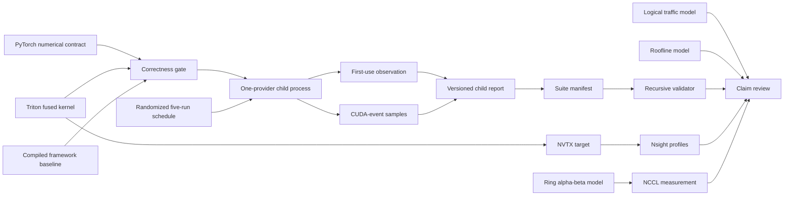

# Architecture

The project is one vertical slice through the performance stack. Its center is a
fused residual-plus-RMSNorm forward operation; the surrounding components make its
correctness, cost assumptions, measurements, and distributed context inspectable.



## Numerical contract

For input row `x`, residual row `r`, learned weight `w`, and positive epsilon `e`,
the operation is:

```text
s = fp32(x) + fp32(r)
y = cast_input_dtype(s * rsqrt(mean(s * s) + e) * fp32(w))
```

The reference is differentiable. The Triton implementation is explicitly forward
only; it rejects tensors requiring gradients instead of silently returning an
incorrect training graph. Automatic dispatch falls back to the reference when the
device, dtype, layout, size, or gradient contract is not supported.

## Kernel shape

One Triton program owns one row. It loads the input and residual with a power-of-two
mask, accumulates the sum of squares in FP32, applies the reciprocal root mean square
and weight, then stores once. The launch uses at most eight warps and refuses a final
dimension occupying more than 64 KiB, matching the resource boundary used in the
official Triton normalization tutorial.

That simple row ownership is easy to audit and works for common hidden dimensions.
It is not assumed optimal. Wider rows, small row counts, register pressure, and newer
hardware may favor multi-CTA reductions, persistent scheduling, or a library kernel.

## Modeling boundary

The traffic model counts logical same-width tensor transfers for two written
algorithms. It does not infer DRAM transactions. The roofline model computes an ideal
ceiling from user-supplied peaks. The ring model assumes a homogeneous, contention-free
ring and excludes reduction-compute cost. Each model is paired with a measurement path
that can expose where those assumptions fail.

## Measurement and report boundary

The canonical suite owns scheduling and process isolation; the child benchmark owns
tensor construction, correctness, and timing. A child process receives one provider,
one dtype, a complete shape grid, and the seed registered for its process-level run.
The manifest records the deterministic shuffled schedule and relative child paths.

JSON Schema validates each document's shape. The recursive validator adds constraints
that are relational rather than local: schedule completeness, path confinement,
canonical replay commands, commit/dirty-state agreement, and matching seeds,
providers, dtypes, and shapes. Schemas ship inside the wheel so installed tools do not
depend on a source checkout or network access.

The benchmark reports first-use and steady-state timing separately. First-use uses a
host clock around a synchronized provider invocation and may include lazy compilation.
Steady-state samples use CUDA events after warmup. Neither is interchangeable with an
end-to-end serving latency measurement.

## Extension points

- Add a backward kernel without changing the forward contract.
- Add a native CUDA or CUTLASS comparator behind a new explicit provider.
- Add device-specific launch configurations selected from checked-in tuning results.
- Extend the collective benchmark with all-gather, reduce-scatter, and overlap tests.
- Add low-precision kernels only with format-aware accuracy and scaling tests.
