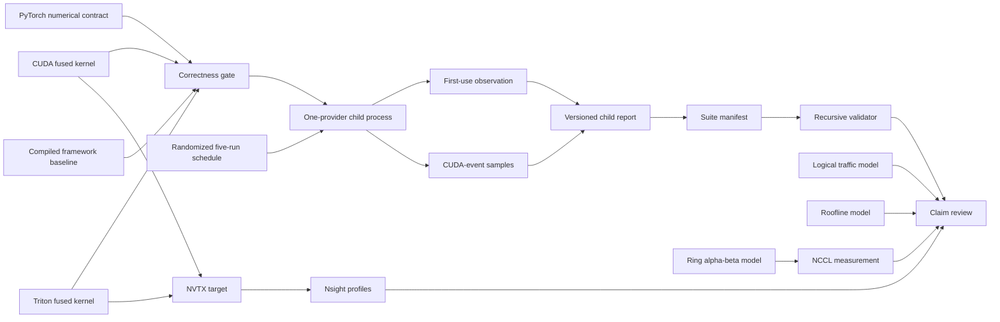

# Architecture

The project is one vertical slice through the performance stack. Its center is a
fused residual-plus-RMSNorm forward operation; the surrounding components make its
correctness, cost assumptions, measurements, and distributed context inspectable.



## Numerical contract

For input row `x`, residual row `r`, learned weight `w`, and positive epsilon `e`,
the operation is:

```text
s = fp32(x) + fp32(r)
y = cast_input_dtype(s * rsqrt(mean(s * s) + e) * fp32(w))
```

Output agreement is scale-aware: every finite element must satisfy
`abs(actual - expected) <= atol + rtol * abs(expected)` using the framework's
documented defaults for its dtype. Reports retain the maximum absolute error, the
maximum ratio to that per-element allowance, and compact reference/error witnesses so
the offline validator can recompute both summaries. Historical absolute-only report
versions remain valid as records but are not rewritten under the newer rule.

The reference is differentiable. The CUDA and Triton implementations are explicitly
forward only; they reject tensors requiring gradients instead of silently returning
an incorrect training graph. Automatic dispatch remains conservative and falls back
to the reference when the Triton device, dtype, layout, size, or gradient contract is
not supported. The CUDA extension is selected only when explicitly requested. The
supported Triton releases require NVIDIA compute capability 8.0 or newer; automatic
dispatch falls back on older targets, and an explicit Triton request reports the
observed capability instead of entering an unsupported compiler path.

## Kernel shape

One Triton program owns one row. It loads the input and residual with a power-of-two
mask, accumulates the sum of squares in FP32, applies the reciprocal root mean square
and weight, then stores once. The launch uses at most eight warps and refuses a final
dimension occupying more than 64 KiB, matching the resource boundary used in the
official Triton normalization tutorial.

That simple row ownership is easy to audit and works for common hidden dimensions.
It is not assumed optimal. Wider rows, small row counts, register pressure, and newer
hardware may favor multi-CTA reductions, persistent scheduling, or a library kernel.

The CUDA implementation also owns one row per block. Two hundred fifty-six threads
make coalesced FP16 loads, use compensated FP32 summation for each thread's square
terms, reduce first within warps and then across eight warp totals in shared memory,
and make a second coalesced pass to write the normalized output. Compensated local
summation was introduced as a response to an observed wide-row discrepancy, but it did
not eliminate the remaining one-element mismatch under the original absolute-only
gate. It is retained as a defensive accumulation choice, not presented as a proven
root-cause fix. The later scale-aware experiment is a separately versioned contract.
The second pass trades redundant input loads for a small, portable state footprint.

## Modeling boundary

The traffic model counts logical same-width tensor transfers for two written
algorithms. It does not infer DRAM transactions. The roofline model computes an ideal
ceiling from user-supplied peaks. The ring model assumes a homogeneous, contention-free
ring and excludes reduction-compute cost. Each model is paired with a measurement path
that can expose where those assumptions fail.

## Measurement and report boundary

The canonical suite owns scheduling and process isolation; the child benchmark owns
tensor construction, correctness, and timing. A child process receives one provider,
one dtype, a complete shape grid, and the seed registered for its process-level run.
The manifest records the deterministic shuffled schedule and relative child paths.

JSON Schema validates each document's shape. The recursive validator adds constraints
that are relational rather than local: schedule completeness, path confinement,
canonical replay commands, commit/dirty-state agreement, and matching seeds,
providers, dtypes, shapes, and recorded correctness decisions. Schemas ship inside the
wheel so installed tools do not depend on a source checkout or network access.

The benchmark reports first-use and steady-state timing separately. First-use uses a
host clock around a synchronized provider invocation and may include lazy compilation.
Steady-state samples use CUDA events after warmup. Neither is interchangeable with an
end-to-end serving latency measurement.

## Extension points

- Add a backward kernel without changing the forward contract.
- Add a CUTLASS or structured framework comparator behind a new explicit provider.
- Add device-specific launch configurations selected from checked-in tuning results.
- Extend the collective benchmark with all-gather, reduce-scatter, and overlap tests.
- Add low-precision kernels only with format-aware accuracy and scaling tests.
